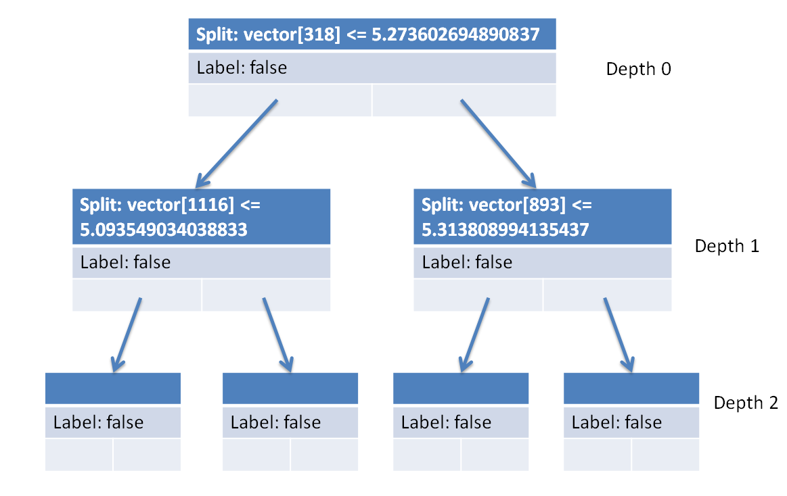
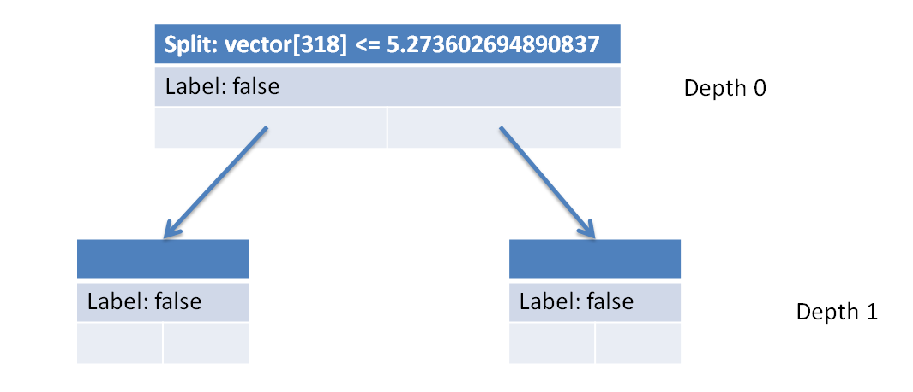

# Text Classifier

Inspired by [Perspective API](https://www.perspectiveapi.com/) and its real-time comment moderation tools, this Java programming assignment is about improving online conversations by implementing a decision tree data type for text classification. Although this assignment applies concepts from machine learning and natural language processing, the assignment as presented is designed for a second course in computer programming focusing on 4 fundamental binary search tree operations: construction, search, traversal, and removal. By working on this assignment, students will:

- Define methods that recursively traverse binary trees and modify binary tree node data values.
- Apply the binary search tree invariant to search for values and add new values to a tree.
- Apply the `x = change(x)` pattern to recursively change binary tree references.

Online abuse and harassment stops people from engaging in conversation. One area of focus is the study of negative online behaviors, such as **toxic comments**: user-written comments that are rude, disrespectful or otherwise likely to make someone leave a discussion. Platforms struggle to effectively facilitate conversations, leading many communities to [limit](https://meta.stackexchange.com/q/342779) or [completely shut down](https://en.wikipedia.org/wiki/R/The_Donald#Quarantine,_restriction,_ban_and_successor) user comments. In 2018, the [Conversation AI](https://conversationai.github.io/) team, a research initiative founded by [Jigsaw](https://jigsaw.google.com/) and Google (both part of Alphabet), organized a public competition called the [Toxic Comment Classification Challenge](https://www.kaggle.com/c/jigsaw-toxic-comment-classification-challenge) to build better machine learning systems for detecting different types of of toxicity like threats, obscenity, insults, and identity-based hate.

Toxic comment classification is a special case of a more general problem in machine learning known as **text classification**. Discussion forums use text classification to determine whether comments should be flagged as inappropriate. Email software uses text classification to determine whether incoming mail is sent to the inbox or filtered into the spam folder.[^1]


[^1]: Google Developers. Oct 1, 2018. Text classification. In Machine Learning Guides. <https://developers.google.com/machine-learning/guides/text-classification>

> ✨ Try out the [**toxicity text classifier web app**](https://toxicity-classification.herokuapp.com/). The first visit may take 30–60 seconds for the server to wake up and train the model on-the-fly. Enter a few phrases into the text box to see what the model thinks.

As a problem, text classification directly engages the social implications of computing: students learn how programming can address (but fail to fully solve) real-world problems that not only have impacts on students daily lives, but also broader questions of public interest and social justice. Bias in machine learning algorithms can arise not only from the code—the ideas and values encoded in the mutually-exclusive binary decision tree logic[^2]—but also in the "quality of the data they process: imperfect, biased inputs lead to imperfect, biased outputs."[^3] This assignment provides an opportunity to explore both coding and data together.

[^2]: Kevin Lin. 2021. Do Abstractions Have Politics? Toward a More Critical Algorithm Analysis. In 2021 Conference on Research in Equitable and Sustained Participation in Engineering, Computing, and Technology (RESPECT). <https://doi.org/10.1109/RESPECT51740.2021.9620635>

[^3]: Amy J. Ko, Alannah Oleson, Neil Ryan, Yim Register, Benjamin Xie, Mina Tari, Matthew Davidson, Stefania Druga, and Dastyni Loksa. 2020. It is time for more critical CS education. In Commun. ACM 63, 11 (November 2020), 31–33. <https://doi.org/10.1145/3424000>

> ⚠️ Machine learning models are trained on human-selected and human-generated datasets. Such models reproduce the bias inherent in the data. The included data representation algorithms also encode overly-simplistic assumptions about natural language by treating each occurrence of a word as independent from all other words in the text. Any usage of a word, no matter the context, is considered equally toxic. Don't use this in a real system! Furthermore, when the Conversation AI team first built toxicity models, they found that their models [incorrectly learned to associate the names of frequently-attacked identities with toxicity](https://medium.com/the-false-positive/unintended-bias-and-names-of-frequently-targeted-groups-8e0b81f80a23). Designing robust models is hard!

There are three provided datasets: `toxic.tsv`, `tiny.tsv`, and `spam.tsv`.

> ⚠️ The provided `toxic.tsv` and `tiny.tsv` files contain text that may be considered profane, vulgar, or offensive. If you plan to re-distribute this assignment, please exercise caution and review the text content carefully. While the assignment does not ask students to read any of the text in the `tsv` files, the contents of the files may be inadvertently displayed by error messages or other parts of the program during the course of development. We recommend using the `spam.tsv` file.

Alternatively, consider asking students to generate their own datasets using text messages or emails they've received from others. This can be a valuable exercise for students to learn how data can be formatted and the vast quantity of data that the classifier needs before it begins to function robustly. `tsv` ([tab-separated values](https://en.wikipedia.org/wiki/Tab-separated_values)) files can be [converted from a spreadsheet](https://support.google.com/merchants/answer/160569?hl=en) or carefully written in a text editor. Our format requires two columns: for each entry, a **label** and the corresponding **message**.

| label | message                                           |
| ----- | ------------------------------------------------- |
| True  | This is a message that I want to flag.            |
| False | This is a message that I **do not** want to flag. |
| True  | This is another message that I want to flag.      |
| True  | Yet another message that I want to flag.          |
| False | Another message that I **do not** want to flag.   |

## Specification

Implement a `TextClassifier` data type, a binary decision tree for classifying text documents.

### `TextClassifier(Vectorizer vectorizer, Splitter splitter)`

Constructs a new `TextClassifier` given a fitted `vectorizer` for transforming data points and a `splitter` for determining the splits in the tree. In other words, construct a tree with the given parameters.

We've done something similar before in section using a `Scanner` instead of a `Splitter`. Just like how the values returned from each call to the `Scanner` defined the shape of the binary tree from section, the values returned from each call to the `Splitter` will define the shape of the decision tree. To use the `Splitter`, first call `Splitter.split()` to get a `Splitter.Result`.

If the result is not `null`, construct a `Node` with the following arguments.

- `int index` from the `index` of `Splitter.Result`.
- `double threshold` from the `threshold` of `Splitter.Result`.
- `boolean label` from `Splitter.label()`.
- `Node left` by recursively growing the `left` side `Splitter.Result`.
- `Node right` by recursively growing the `right` side of `Splitter.Result`.

Otherwise, if the result is `null`, construct a `Node` with only the `Splitter.label()`.

### `boolean classify(String text)`

Returns a boolean representing the predicted label for the given `text` by recursively traversing the tree to the correct leaf node. To determine whether to traverse left or right, call `vectorizer.transform(text)[0]` to get a `vector` and then compare `vector[root.index]` to `root.threshold`. If `vector[root.index] <= root.threshold`, then go left; otherwise, go right. Make sure to avoid redundant work by calling `vectorizer.transform(text)[0]` once!

### `void print()`

Prints a Java code representation of this decision tree in if/else statement format without braces and with 1 additional indentation space per level in the decision tree. Leaf nodes should print "return true;" or "return false;" depending on the label value. For the example tree shown below, we've given the result of calling `print()` with extra comments pointing out each indentation level corresponding to each level in the tree.



```java
// Depth 0
if (vector[318] <= 5.273602694890837)
 // Depth 1
 if (vector[1116] <= 5.093549034038833)
  // Depth 2
  return false;
 else
  return false;
else
 // Depth 1
 if (vector[893] <= 5.313808994135437)
  // Depth 2
  return false;
 else
  return false;
```

### `void prune(int depth)`

Prunes this tree to the given `depth`. Each pruned subtree is replaced with a new node representing the subtree's majority label. For example, pruning the above decision tree to depth 1 would result in the following structure after calling `print()`. Don't forget to use the `x = change(x)` pattern.



```java
if (vector[318] <= 5.273602694890837)
 return false;
else
 return false;
```

## Running the app

To check the classifier's training accuracy, open your terminal, paste the following command, and press <kbd>Enter</kbd>

```sh
javac TextClassifier.java && java TextClassifier; rm *.class
```

To launch the web app, open your terminal, paste the following command, and press <kbd>Enter</kbd>

```sh
javac Server.java && java Server toxic.tsv; rm *.class
```

Then, open your browser and navigate to <https://localhost:8000>.

A JUnit 5 `TextClassifierTest` class is provided, though it requires a `GoodTextClassifier` reference solution with a modified `print` method that returns the expected string result (rather than actually printing it to the console).
