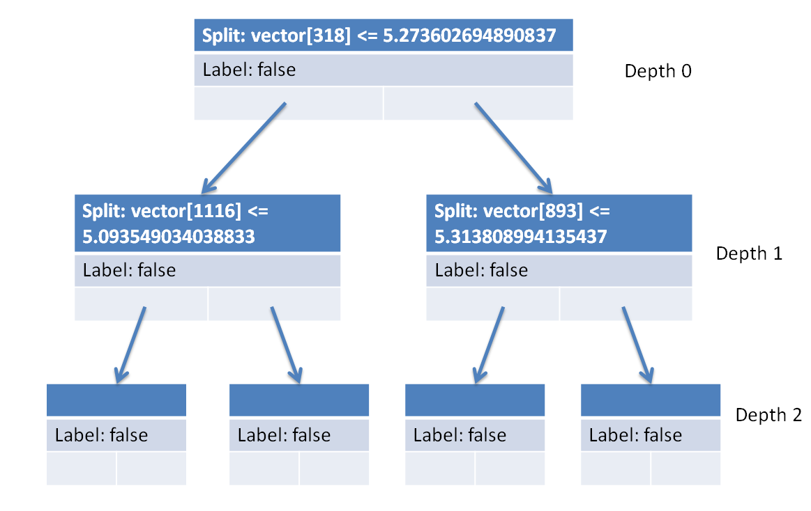
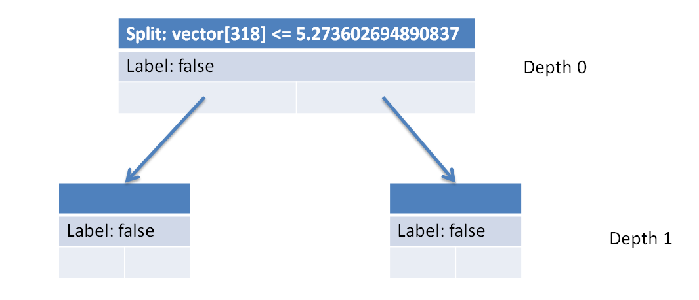

# Text Classifier

Inspired by [Perspective API](https://www.perspectiveapi.com/) and its real-time comment moderation tools, this Java programming assignment is about improving online conversations by implementing a decision tree data type for text classification. Although this assignment applies concepts from machine learning and natural language processing, the assignment as presented is designed for a second course in computer programming focusing on 4 fundamental binary search tree operations: construction, search, traversal, and removal. By working on this assignment, students will:

- Define methods that recursively traverse binary trees and modify binary tree node data values.
- Apply the binary search tree invariant to search for values and add new values to a tree.
- Apply the `x = change(x)` pattern to recursively change binary tree references.

Online abuse and harassment stops people from engaging in conversation. One area of focus is the study of negative online behaviors, such as **toxic comments**: user-written comments that are rude, disrespectful or otherwise likely to make someone leave a discussion. Platforms struggle to effectively facilitate conversations, leading many communities to [limit](https://meta.stackexchange.com/q/342779) or [completely shut down](https://en.wikipedia.org/wiki/R/The_Donald#Quarantine,_restriction,_ban_and_successor) user comments. In 2018, the [Conversation AI](https://conversationai.github.io/) team, a research initiative founded by [Jigsaw](https://jigsaw.google.com/) and Google (both part of Alphabet), organized a public competition called the [Toxic Comment Classification Challenge](https://www.kaggle.com/c/jigsaw-toxic-comment-classification-challenge) to build better machine learning systems for detecting different types of of toxicity like threats, obscenity, insults, and identity-based hate.

Toxic comment classification is a special case of a more general problem in machine learning known as **text classification**. Discussion forums use text classification to determine whether comments should be flagged as inappropriate. Email software uses text classification to determine whether incoming mail is sent to the inbox or filtered into the spam folder.[^1]


[^1]: Google Developers. Oct 1, 2018. Text classification. In Machine Learning Guides. <https://developers.google.com/machine-learning/guides/text-classification>

> ✨ Try out the [**toxicity text classifier web app**](https://toxicity-classification.herokuapp.com/). The first visit may take 30–60 seconds for the server to wake up and train the model on-the-fly. Enter a few phrases into the text box to see what the model thinks.

## Background

As a problem, text classification directly engages the social implications of computing: students learn how programming can address (but fail to fully solve) real-world problems that not only have impacts on students daily lives, but also broader questions of public interest and social justice. Bias in machine learning algorithms can arise not only from the code—the ideas and values encoded in the mutually-exclusive binary decision tree logic[^2]—but also in the "quality of the data they process: imperfect, biased inputs lead to imperfect, biased outputs."[^3] This assignment provides an opportunity to explore both coding and data together.

[^2]: Kevin Lin. 2021. Do Abstractions Have Politics? Toward a More Critical Algorithm Analysis. In 2021 Conference on Research in Equitable and Sustained Participation in Engineering, Computing, and Technology (RESPECT). <https://doi.org/10.1109/RESPECT51740.2021.9620635>

[^3]: Amy J. Ko, Alannah Oleson, Mara Kirdani-Ryan, Yim Register, Benjamin Xie, Mina Tari, Matthew Davidson, Stefania Druga, and Dastyni Loksa. 2020. It is time for more critical CS education. In Commun. ACM 63, 11 (November 2020), 31–33. <https://doi.org/10.1145/3424000>

> ⚠️ Machine learning models are trained on human-selected and human-generated datasets. Such models reproduce the bias inherent in the data. The included data representation algorithms also encode overly-simplistic assumptions about natural language by treating each occurrence of a word as independent from all other words in the text. Any usage of a word, no matter the context, is considered equally toxic. Don't use this in a real system! Furthermore, when the Conversation AI team first built toxicity models, they found that their models [incorrectly learned to associate the names of frequently-attacked identities with toxicity](https://medium.com/the-false-positive/unintended-bias-and-names-of-frequently-targeted-groups-8e0b81f80a23).

We spend time discussing the social problems the system attempts to address and the assumptions the system makes in the process. Designing robust models is hard! But even if our text classifier were perfect, is the ideal solution to toxic content more moderation and more penalties? This problem is ultimately about dealing with harm. As humans, we have been conditioned to understand certain ways of dealing with harm that often emphasize vengence. [Restorative practices](https://en.wikipedia.org/wiki/Restorative_practices) offer a different set of principles that this technology could be applied toward. The development process for the assignment complicates this narrative even further: we ask students to use classes written by someone else (library code), where much of the decisionmaking and design is abstracted-away and done by someone else (the authors of this assignment). What are the values and assumptions encoded in the library code too? How might the library code [application programming interfaces](https://en.wikipedia.org/wiki/API) shape the way that programmers think about designing their programs?[^2]

There are three provided datasets: `toxic.tsv`, `tiny.tsv`, and `spam.tsv`.

> **Instructors**: The provided `toxic.tsv` and `tiny.tsv` files contain text that may be considered profane, vulgar, or offensive. If you plan to re-distribute this assignment, exercise caution and review the text content carefully. Even though the assignment does not ask students to read any of the text in the `tsv` files, the contents of the files may be inadvertently displayed by error messages or other parts of the program during the course of development. We recommend at least including a clear warning about the contents of the files and condemn harmful content.

Alternatively, consider asking students to generate their own datasets using text messages or emails they've received from others. This can be a valuable exercise for students to learn how data can be formatted and the vast quantity of data that the classifier needs before it begins to function robustly. `tsv` ([tab-separated values](https://en.wikipedia.org/wiki/Tab-separated_values)) files can be [converted from a spreadsheet](https://support.google.com/merchants/answer/160569?hl=en) or carefully written in a text editor. Our format requires two columns: for each entry, a **label** and the corresponding **message**.

| label | message                                           |
| ----- | ------------------------------------------------- |
| True  | This is a message that I want to flag.            |
| False | This is a message that I **do not** want to flag. |
| True  | This is another message that I want to flag.      |
| True  | Yet another message that I want to flag.          |
| False | Another message that I **do not** want to flag.   |

## Specification

Implement the `TextClassifier` data type, a decision tree for classifying text documents. A **decision tree** is a special binary tree that can classify messages by learning a hierarchy of questions from a large training dataset of examples. The kinds of questions that the decision tree will ask are of the form: How frequently does each term appear in the message? For example, if we have a spam message like "Snow plows: Find more savings online" the appearance of "snow" and "savings" might each contribute into the decision to classify it as spam. In Java, this logic can be represented using nested `if` statements.

```java
if (message.toLowerCase().contains("snow"))
  if (message.toLowerCase().contains("savings"))
    return true; // If we see "snow" and "savings" together, it has to be spam!
  else
    return false; // If we only see "snow", it's probably not spam.
else
  return false; // If we don't see "snow", it's also probably not spam.
```

This is a very simple approach, so it's easy for spammers to get around this by slightly modifying the words they use: the code won't detect "save" in the same way that it detects "savings". And there are common words like "find" or "more": do we treat them the same way as other adjectives or nouns that might provide more information? Furthermore, there might be more effective ways to order the questions too: maybe we should have "savings" rather than "snow" as the root question. All of these are considerations that our `TextClassifier` will handle.

1. To handle slightly different spellings, the `Vectorizer` class turns each message into a **vector**, an array of numbers representing the value of each word. The words in the message are stemmed to their standardized forms, like "snow plow find more save onlin". It also learns numeric value of each word: common words like "the" are less valuable because they don't contribute much to the meaning of the message.
1. To learn the best questions to ask, the `Splitter` class uses each **vector** in the dataset to make decisions on which questions to ask first. In our snow plow example, we might say that "save" is more valuable than "snow" for classifying spam. The `Splitter.Result` communicates this idea by finding the best `index` into the vector (picking the word out of the array) and the `threshold` for value.
1. Putting both of these pieces together, the `TextClassifier` is constructed according to the splitter's decisions. When we want to classify a new message, the new message is vectorized and we follow the hierarchy of questions encoded in the tree until we find a true or false leaf node.

`Vectorizer` and `Splitter` are complicated programs, so we've already written them for you. We certainly don't expect you to fully understand how they work. The focus of this assignment is about implementing `TextClassifier` using what we've learned about binary tree programming.

### `TextClassifier(Vectorizer vectorizer, Splitter splitter)`

Constructs a new `TextClassifier` given a `splitter` for determining the splits in the tree. In other words, construct a tree with the given parameters where each `Node` in the tree represents a split in the data. The constructor also takes a `vectorizer`, but it's only used for implementing another method, `classify`, so all you have to do for now is save the `vectorizer` as a field in your tree.

We've done something similar before in section using a `Scanner` instead of a `Splitter`.[^4] Just like how the values returned from each call to the `Scanner` defined the shape of the binary tree, the values returned from each call to the `Splitter` will define the shape of the decision tree. To use the `Splitter`, first call `Splitter.split()` to get a `Splitter.Result`.

[^4]:
    Write a method `readTree` that accepts a `Scanner` as a parameter and that replaces the current tree with one constructed from data stored in the `Scanner`. The data is formatted based on a pre-order traversal with one line for each node. Each line of input has a code indicating the type of node, followed by the data in the node. Consider the following input as an example.

    ```
    3 7
    1 9
    0 5
    3 8
    2 4
    0 9
    0 6
    ```

    The tree corresponding to the input is given below.

    ```
              +---+
              | 7 |
              +---+
             /     \
         +---+     +---+
         | 9 |     | 8 |
         +---+     +---+
        /         /     \
    +---+     +---+     +---+
    | 5 |     | 4 |     | 6 |
    +---+     +---+     +---+
                   \
                   +---+
                   | 9 |
                   +---+
    ```

    Each node `data` value is preceded by an identifier: either 0, 1, 2, or 3.

    - **0** indicates that the associated value is a leaf node (with no children).
    - **1** indicates a branch node with left child only.
    - **2** indicates a branch node with right child only.
    - **3** indicates a branch node with both left and right children.

Then, if the result is not `null`, construct a new `Node` with the following arguments.

- `int index` from the `index` of `Splitter.Result`.
- `double threshold` from the `threshold` of `Splitter.Result`.
- `boolean label` from `Splitter.label()`.
- `Node left` by **recursively growing** the `left` side `Splitter.Result`.
- `Node right` by **recursively growing** the `right` side of `Splitter.Result`.

Otherwise, if the result is `null`, construct a new `Node` with only the `Splitter.label()`.

### `boolean classify(String text)`

Returns a boolean representing the predicted label for the given `text` by recursively traversing the tree to the correct leaf node. To determine whether to traverse left or right, call `vectorizer.transform(text)[0]` to get a `vector` and then compare `vector[root.index]` to `root.threshold`. If `vector[root.index] <= root.threshold`, then go left; otherwise, go right. Make sure to avoid redundant work by calling `vectorizer.transform(text)[0]` once!

### `void print()`

Prints a Java code representation of this decision tree in if/else statement format without braces and with 1 additional indentation space per level in the decision tree. Leaf nodes should print "return true;" or "return false;" depending on the label value. For the example tree shown below, we've given the result of calling `print()`.



```java
if (vector[318] <= 5.273602694890837)
 if (vector[1116] <= 5.093549034038833)
  return false;
 else
  return false;
else
 if (vector[893] <= 5.313808994135437)
  return false;
 else
  return false;
```

### `void prune(int depth)`

Prunes this tree to the given `depth`. Each pruned subtree is replaced with a new node representing the subtree's majority label. For example, pruning the above decision tree to depth 1 would result in the following structure after calling `print()`. Don't forget to use the `x = change(x)` pattern.



```java
if (vector[318] <= 5.273602694890837)
 return false;
else
 return false;
```

## Running the app

> **Instructors**: A JUnit 5 `TextClassifierTest` integration test suite is provided with hard-coded expected results. Contact the authors for a copy of the solution class. The integration tests provide a basic check on the behavior of the code, but the feedback that is offered is quite limited so we recommend designing other feedback or support mechanisms for students.

To run the classifier and print a 10-level pruned tree, open your terminal, paste the following command, and press <kbd>Enter</kbd>

```sh
javac TextClassifier.java && java TextClassifier toxic.tsv; rm *.class
```

To launch the web app, open your terminal, paste the following command, and press <kbd>Enter</kbd>

```sh
javac Server.java && java Server toxic.tsv; rm *.class
```

Then, open your browser and navigate to <https://localhost:8000>.

## License

<span xmlns:dct="http://purl.org/dc/terms/" property="dct:title">Text Classifier</span> by <a xmlns:cc="http://creativecommons.org/ns#" href="https://kevinl.info/" property="cc:attributionName" rel="cc:attributionURL">Kevin Lin</a> is licensed under a <a rel="license" href="http://creativecommons.org/licenses/by/4.0/">Creative Commons Attribution 4.0 International License</a>.
